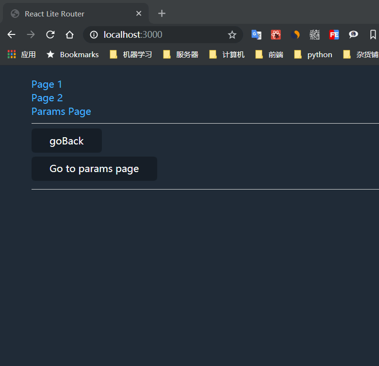

# 前端路由实现

这个项目只为学习前端路由如何实现, 不打算能应用到生产环境.  
`npm i` 然后 `npm run start` 启动应用查看效果.



## 路由实现思路

`url` 改变 -> 应用路由改变 -> 触发应用更新.  
反过来
页面更新 -> 修改 `url` -> 不刷新页面修改 url

能实现上述能力的浏览器接口有两对:  

1. `history.pushState`, `history.replaceState` 和 `popstate` 事件.
2. `hash` 和 `hashchange` 事件

这里只使用第一对接口做研究. 

## `pushState` 与 `popstate` 如何配合使用

每当处于激活状态的历史记录条目发生变化时, `popstate` 事件就会在对应 `window` 对象上触发. 但是调用 `history.pushState()` 和 `history.replaceState()` 却不会触发这个事件. 所以, 我们需要劫持原生的这两个事件, 做点处理.

```js
/*
  pushState 不会触发 popstate 事件,
  所以需要劫持原生的 pushstate, 然后手动触发 popstate 事件
*/
const originPushState = window.history.pushState
window.history.pushState = function(...params) {
  // 调用原生的 pushState
  originPushState.apply(window.history, params)
  // 手动触发 popstate 事件
  dispatchEvent(new PopStateEvent('popstate'))
}
```

## 顶层 Router 实现

```ts
// 创建一个 context 作为路由上下文, 并将应用包裹其中
// Router　下面的组件就都能收到路由状态
const RouterCtx = createContext<string>('/')
const Router: FC = ({ children }) => {
  const [path, setPath] = useState(window.location.pathname)

  useEffect(() => {
    window.addEventListener('popstate', function() {
      setPath(window.location.pathname)
    })
  }, [])

  return (
    <RouterCtx.Provider value={path}>
      {children}
    </RouterCtx.Provider>
  )
}
```

## Route 组件

```ts
/*
  1. 当前 url 与 Route 的 path 匹配上的时候, 则渲染组件. 这里使用了 path-to-regexp 来方便解析 path.
  2. 为了能让 Route 下的组件能通过 useParams 获取路由参数, 创建一个 context 包裹要渲染的组件.
     如果有 Route 嵌套, React 会选择最近的 Ctx. https://zh-hans.reactjs.org/docs/context.html#contextprovider
*/
const ParamsCtx = createContext<IParams>({})
const Route: FC<IRouteProps> = ({ path, component: Com }) => {
  const curPath = useContext(RouterCtx)
  const m = match(path)(curPath)

  return (
    <ParamsCtx.Provider value={ m ? m.params as { [p: string]: string } : {} }>
      <>
      {
        isMatchPath(path, curPath)
        ? <Com />
        : null
      }
      </>
    </ParamsCtx.Provider>
  )
}
```

## Link 组件实现

为了实现切换 url 不刷新页面, 需要我们把 a 标签的默认事件阻止, 然后用 `pushState` 修改 `url`

```ts
/*
  Link 组件阻止 a 标签默认跳转事件, 使用 pushState 进行跳转
*/
const Link: FC<React.AnchorHTMLAttributes<HTMLAnchorElement> & { to: string }> = ({ to, children, onClick, ...props }) => {
  const jumpTo = useCallback((e: React.MouseEvent<HTMLAnchorElement, MouseEvent>) => {
    e.preventDefault()
    onClick && onClick(e)
    window.history.pushState({}, '', to)
  }, [])
  return <a {...props} href={to} onClick={jumpTo}>{children}</a>
}
```

参考文档:  
[pushState](https://developer.mozilla.org/zh-CN/docs/Web/API/History_API#%E6%B7%BB%E5%8A%A0%E5%92%8C%E4%BF%AE%E6%94%B9%E5%8E%86%E5%8F%B2%E8%AE%B0%E5%BD%95%E4%B8%AD%E7%9A%84%E6%9D%A1%E7%9B%AE)  
[popstate](https://developer.mozilla.org/zh-CN/docs/Web/API/Window/onpopstate)